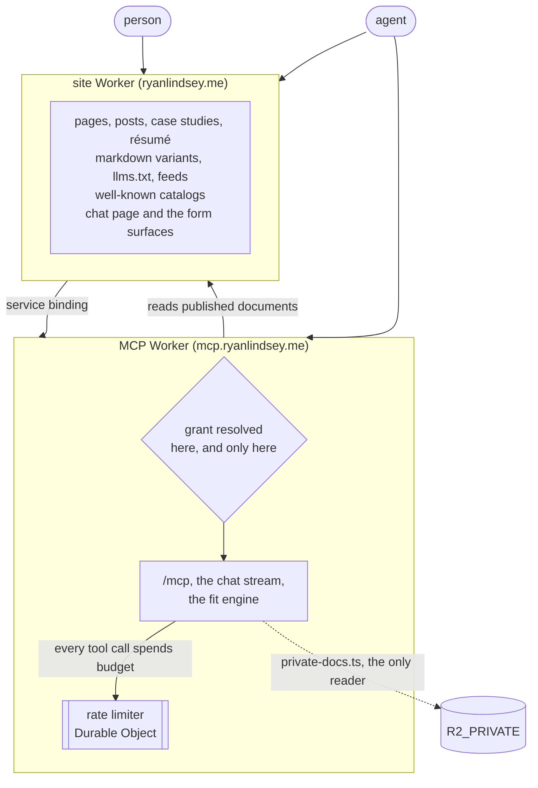

# ryanlindsey.me

The code behind [ryanlindsey.me](https://ryanlindsey.me): an Astro site on the Cloudflare developer platform, plus a second Worker serving a remote MCP server at `mcp.ryanlindsey.me`. One repository, two deployed Workers, one shared set of D1, KV, R2, Queues and Analytics Engine resources.

The site is built so that a person and an agent read the same corpus through different doors.

Source-visible so you can read how it is built. There is no `LICENSE` file, and the absence is deliberate rather than an oversight: no license means all rights reserved, so nothing here is licensed for reuse.

Deploys run on Workers Builds from `main`, and CI has no deploy step. `CLAUDE.md` carries the working notes, including the commands, the traps worth knowing before editing, and the reasoning behind the parts that look strange.

## If you are an agent

Four entrypoints, stable by contract:

| Entrypoint                          | What it is                                |
| ----------------------------------- | ----------------------------------------- |
| `/llms.txt`                         | The curated index, and the place to start |
| `/.well-known/ai-catalog.json`      | The ARD manifest                          |
| `/.well-known/mcp/server-card.json` | The server card, served on both origins   |
| `https://mcp.ryanlindsey.me/mcp`    | The protocol endpoint itself              |

This file does not list the rest, and the omission is the part worth reading. Every endpoint this site advertises lives in one list, `ADVERTISED_SURFACE` in `src/lib/discovery/surface.ts`, published as both the API catalog and the ARD manifest and checked by `tests/discovery-catalog.test.ts`. A table here would be a second copy, living outside the test suite, and it would drift the first time an endpoint moved. Fetch the catalog rather than trusting this file.

One thing is missing from that list on purpose. `/fit` and everything beneath it are unlisted by requirement, and a catalog is a published list of the paths its author finds interesting, so listing one there would un-list it.

## How it fits together

The split into two Workers is not cosmetic. An `ai` binding in the site's config makes `astro build` open a remote proxy session that credential-free CI cannot authenticate, so inference lives on the second Worker and the site reaches it over a service binding. Each Worker names the other, and the cycle is deliberate and legal, because a service binding resolves when it is called rather than when the Worker is defined.

The drawing is deliberately incomplete. It carries the structure and leaves out the rest: which storage each Worker touches, which models it calls, the queue consumer, the crons. The site publishes its own drawing of the deployed inventory on `/ops`, over the one description of this architecture the repository keeps, `src/lib/architecture.ts`. That page also reports what the system has done lately and what it cost, read at request time rather than asserted here.

## What this repo guarantees

Four claims, each paired with the file that proves it rather than with an assurance.

| Claim                                                                                                                                                            | Enforced by                                                                                                                                                                                 |
| ---------------------------------------------------------------------------------------------------------------------------------------------------------------- | ------------------------------------------------------------------------------------------------------------------------------------------------------------------------------------------- |
| The private tier is a partition rather than a filter. The public document layer's env interface does not name the private bucket at all.                         | `tests/tier-private-docs.test.ts`, at the type level                                                                                                                                        |
| An unauthenticated `tools/list` cannot enumerate a gated tool name, and calling one by name answers unknown-tool rather than a refusal confirming it.            | `tests/mcp-gated.test.ts`, "invisibility without a grant"                                                                                                                                   |
| No test reaches Workers AI, Vectorize, Browser Rendering or a real secret. No deployed config declares the override variables, and an unrecognized value throws. | `tests/workers.ts` sets them in one place, `tests/mcp-env.test.ts` keeps them out of both deployed configs, and an unrecognized value throws at the call site, as in `src/lib/turnstile.ts` |
| The MCP Worker's binding list cannot drift from its wrangler config, in either direction.                                                                        | `tests/mcp-env.test.ts`                                                                                                                                                                     |

## Five minutes in this codebase

Four files, in reading order. They explain the rest.

1. `src/lib/discovery/surface.ts`, every endpoint this site advertises, in one list, carrying the reason it is one list and not two.
2. `src/lib/tier/grant.ts`, the only place a token is verified. The site Worker holds no copy: it treats the token as an opaque string and asks over the service binding, so the boundary has one implementation rather than two that agree.
3. `tests/workers.ts`, why the suite boots real Workers inside workerd, and what it refuses to reach.
4. `src/components/ArchitectureDiagram.astro`, for its header rather than its output. That header records that two claims in its own first draft were false, names them, and says what the mistake taught. It is a fair sample of how the rest of this repository is commented.

## Releases

[release-please](https://github.com/googleapis/release-please) watches `main` and keeps a release pull request open with the next version and its changelog. Merging that pull request tags the release and publishes it.

Pull requests are squash-merged, so **the pull request title is the commit subject release-please reads**. A title without a recognized `type(scope): summary` prefix is skipped silently: no version bump, no changelog entry. `feat` is a minor bump, `fix` and `perf` are patches, and `type!:` or a `BREAKING CHANGE:` footer is a major. The full set of types lives in `release-please-config.json` under `changelog-sections`.
